# Entity Relationship Diagram

**Version:** 0.1.0
**Status:** Draft
**Related:** SRS v1.0, Domain Model v0.1.0, Database Design v0.1.0

---

## 1. Purpose

This document defines the initial Entity Relationship Diagram (ERD) for the AI-Powered Cafe Management System.

The diagram represents the logical relationships between the core business entities before database schema implementation.

---

## 2. ERD

```mermaid
erDiagram

    USER ||--o| CUSTOMER : "has account"
    USER ||--o| EMPLOYEE : "has record"

    ROLE ||--o{ USER_ROLE : "assigned through"
    USER ||--o{ USER_ROLE : "has"

    ROLE ||--o{ ROLE_PERMISSION : "has"
    PERMISSION ||--o{ ROLE_PERMISSION : "assigned through"

    CATEGORY ||--o{ MENU_ITEM : "contains"
    DEPARTMENT ||--o{ MENU_ITEM : "prepares"

    CUSTOMER ||--o{ ORDER : "places"
    ORDER ||--|{ ORDER_ITEM : "contains"
    MENU_ITEM ||--o{ ORDER_ITEM : "included in"

    MENU_ITEM ||--o| RECIPE : "has"
    RECIPE ||--|{ RECIPE_ITEM : "contains"
    INGREDIENT ||--o{ RECIPE_ITEM : "used in"

    INGREDIENT ||--o| INVENTORY_ITEM : "tracked as"
    DEPARTMENT ||--o{ INVENTORY_ITEM : "manages"

    INVENTORY_ITEM ||--o{ STOCK_MOVEMENT : "has"
    INVENTORY_ITEM ||--o{ INVENTORY_BATCH : "contains"
    INVENTORY_ITEM ||--o{ WASTE_RECORD : "records"

    SUPPLIER ||--o{ PURCHASE : "supplies"
    PURCHASE ||--|{ PURCHASE_ITEM : "contains"
    INVENTORY_ITEM ||--o{ PURCHASE_ITEM : "purchased as"

    ORDER ||--o{ PAYMENT : "paid by"
    PAYMENT ||--o{ REFUND : "may have"

    CUSTOMER ||--o| CREDIT_ACCOUNT : "has"
    CREDIT_ACCOUNT ||--o{ CREDIT_TRANSACTION : "contains"
    ORDER ||--o{ CREDIT_TRANSACTION : "generates"
    PAYMENT ||--o{ CREDIT_TRANSACTION : "settles"

    ORDER ||--o| DELIVERY : "fulfilled by"
    DELIVERY ||--o{ DELIVERY_ASSIGNMENT : "assigned through"
    EMPLOYEE ||--o{ DELIVERY_ASSIGNMENT : "performs"

    USER ||--o{ NOTIFICATION : "receives"
    USER ||--o{ NOTIFICATION_PREFERENCE : "configures"

    CUSTOMER ||--o{ SUPPORT_CASE : "creates"
    ORDER ||--o{ SUPPORT_CASE : "concerns"
    EMPLOYEE ||--o{ SUPPORT_CASE : "assigned to"

    USER ||--o{ AUDIT_EVENT : "performs"


    USER {
        uuid id PK
        string email
        string password_hash
        string status
        datetime created_at
        datetime updated_at
    }

    ROLE {
        uuid id PK
        string name
        string description
    }

    PERMISSION {
        uuid id PK
        string name
        string description
    }

    USER_ROLE {
        uuid user_id FK
        uuid role_id FK
    }

    ROLE_PERMISSION {
        uuid role_id FK
        uuid permission_id FK
    }

    CUSTOMER {
        uuid id PK
        uuid user_id FK
        string name
        string phone
        string email
        string status
        datetime created_at
        datetime updated_at
    }

    EMPLOYEE {
        uuid id PK
        uuid user_id FK
        string name
        string employment_status
        date start_date
        datetime created_at
        datetime updated_at
    }

    CATEGORY {
        uuid id PK
        string name
        string description
        string status
    }

    DEPARTMENT {
        uuid id PK
        string name
        string description
        string status
    }

    MENU_ITEM {
        uuid id PK
        uuid category_id FK
        uuid department_id FK
        string name
        string description
        decimal price
        string availability_status
    }

    ORDER {
        uuid id PK
        uuid customer_id FK
        string order_type
        string status
        decimal subtotal
        decimal delivery_fee
        decimal discount_amount
        decimal total_amount
        datetime created_at
        datetime updated_at
    }

    ORDER_ITEM {
        uuid id PK
        uuid order_id FK
        uuid menu_item_id FK
        decimal quantity
        decimal unit_price
        decimal subtotal
        string special_instruction
    }

    INGREDIENT {
        uuid id PK
        string name
        string unit_of_measure
        string status
    }

    RECIPE {
        uuid id PK
        uuid menu_item_id FK
        string name
        integer version
        string status
    }

    RECIPE_ITEM {
        uuid recipe_id FK
        uuid ingredient_id FK
        decimal quantity
        string unit_of_measure
    }

    INVENTORY_ITEM {
        uuid id PK
        uuid ingredient_id FK
        uuid department_id FK
        decimal current_quantity
        string unit_of_measure
        decimal reorder_level
        string status
    }

    STOCK_MOVEMENT {
        uuid id PK
        uuid inventory_item_id FK
        string movement_type
        decimal quantity
        decimal unit_cost
        string reference_type
        uuid reference_id
        datetime occurred_at
        uuid created_by FK
    }

    INVENTORY_BATCH {
        uuid id PK
        uuid inventory_item_id FK
        string batch_reference
        decimal quantity
        decimal unit_cost
        datetime received_at
        date expiration_date
        string status
    }

    WASTE_RECORD {
        uuid id PK
        uuid inventory_item_id FK
        decimal quantity
        decimal estimated_cost
        string reason
        uuid department_id FK
        uuid recorded_by FK
        datetime recorded_at
    }

    SUPPLIER {
        uuid id PK
        string name
        string phone
        string email
        string address
        string status
    }

    PURCHASE {
        uuid id PK
        uuid supplier_id FK
        string purchase_reference
        date purchase_date
        date received_date
        string status
        decimal total_cost
    }

    PURCHASE_ITEM {
        uuid id PK
        uuid purchase_id FK
        uuid inventory_item_id FK
        decimal quantity
        decimal unit_cost
        decimal total_cost
    }

    PAYMENT {
        uuid id PK
        uuid order_id FK
        uuid customer_id FK
        string payment_method
        string status
        decimal amount
        string provider_reference
        datetime initiated_at
        datetime confirmed_at
    }

    REFUND {
        uuid id PK
        uuid payment_id FK
        decimal amount
        string reason
        string status
        string provider_reference
        uuid created_by FK
    }

    CREDIT_ACCOUNT {
        uuid id PK
        uuid customer_id FK
        decimal credit_limit
        decimal current_balance
        string status
        datetime created_at
        datetime updated_at
    }

    CREDIT_TRANSACTION {
        uuid id PK
        uuid credit_account_id FK
        uuid order_id FK
        uuid payment_id FK
        string transaction_type
        decimal amount
        string reference
        datetime occurred_at
        uuid created_by FK
    }

    DELIVERY {
        uuid id PK
        uuid order_id FK
        string address
        decimal delivery_fee
        string status
        string provider_reference
    }

    DELIVERY_ASSIGNMENT {
        uuid id PK
        uuid delivery_id FK
        uuid rider_id FK
        datetime assigned_at
        datetime picked_up_at
        datetime delivered_at
        string status
    }

    NOTIFICATION {
        uuid id PK
        uuid recipient_user_id FK
        string type
        string channel
        string title
        string content
        string status
        datetime sent_at
        datetime read_at
    }

    NOTIFICATION_PREFERENCE {
        uuid id PK
        uuid user_id FK
        string channel
        string notification_type
        boolean enabled
    }

    SUPPORT_CASE {
        uuid id PK
        uuid customer_id FK
        uuid order_id FK
        uuid assigned_to FK
        string category
        string status
        string subject
        string description
        datetime created_at
        datetime updated_at
    }

    ASSET {
        uuid id PK
        string name
        string category
        integer quantity
        decimal purchase_cost
        string location
        string condition
        string status
        datetime created_at
        datetime updated_at
    }

    AUDIT_EVENT {
        uuid id PK
        uuid actor_user_id FK
        string action
        string entity_type
        uuid entity_id
        datetime occurred_at
        string request_id
    }
```

---

## 3. Relationship Notes

### 3.1 Customer → Order

A customer may place many orders.

### 3.2 Order → Order Item

An order contains one or more order items.

### 3.3 Order Item → Menu Item

An order item references one menu item.

### 3.4 Menu Item → Recipe

A menu item may have a recipe.

### 3.5 Recipe → Ingredient

A recipe contains one or more ingredients through recipe items.

### 3.6 Ingredient → Inventory

An ingredient may be tracked as an inventory item.

### 3.7 Order → Payment

An order may have one or more payment transactions depending on the payment and refund model.

### 3.8 Customer → Credit Account

A customer may have one approved credit account.

### 3.9 Credit Account → Credit Transaction

A credit account contains its financial transaction history.

### 3.10 Order → Delivery

An order may have a delivery when the fulfilment method is delivery.

### 3.11 User → Notification

A user may receive many notifications.

### 3.12 Customer → Support Case

A customer may create multiple support cases.

### 3.13 User → Audit Event

A user may produce many auditable system actions.

---

## 4. Review Status

This ERD is an initial logical model.

The model must be reviewed for:

- Missing relationships.
- Incorrect cardinalities.
- Redundant entities.
- Incorrect ownership.
- Data duplication.
- Historical-data requirements.
- Security requirements.
- Transaction requirements.

The ERD must be approved before implementing the database schema in Drizzle ORM.

---

## 5. Current Status

**Version:** 0.1.0
**Status:** Draft
